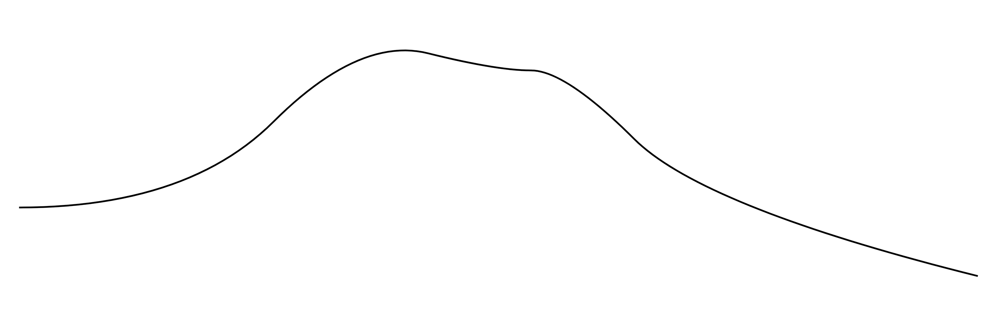
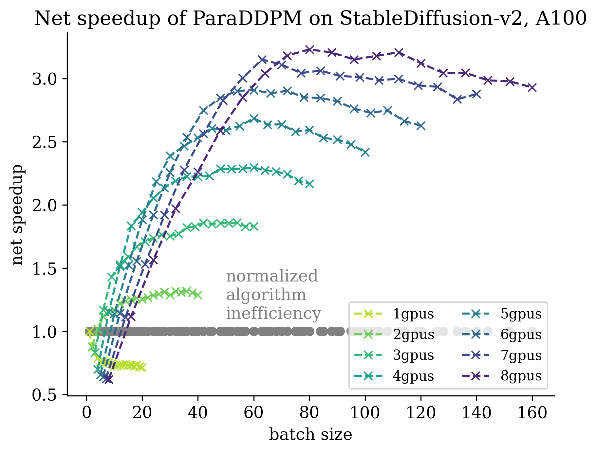
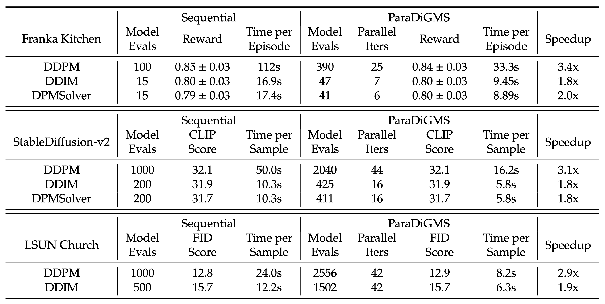

# ParaDiGMS: Parallel Diffusion Generative Model Sampler

This repository contains code for the paper:

[Parallel Sampling of Diffusion Models](https://arxiv.org/abs/2305.16317) \
by Andy Shih, Suneel Belkhale, Stefano Ermon, Dorsa Sadigh, Nima Anari

<br>

ParaDiGMs accelerates sampling of diffusion models without sacrificing quality by running denoising steps in parallel. ParaDiGMs is most useful when sampling with a large number of denoising steps on multiple GPUs, giving a 2-4x wallclock speedup.


## Animation of Algorithm



## Sample Images


## Speedup of 1000-step DDPM on A100


## Results on Image and Robotics Diffusion Models


## Citation

If you find our work useful, consider citing:

```
@misc{shih2023paradigms,
    title = {Parallel Sampling of Diffusion Models},
    author={Shih, Andy and Belkhale, Suneel and Ermon, Stefano and Sadigh, Dorsa and Anari, Nima},
    publisher = {arXiv},
    year = {2023},
}
```